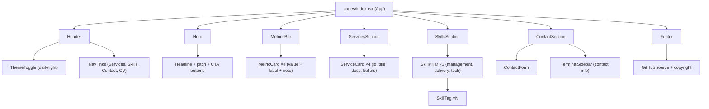
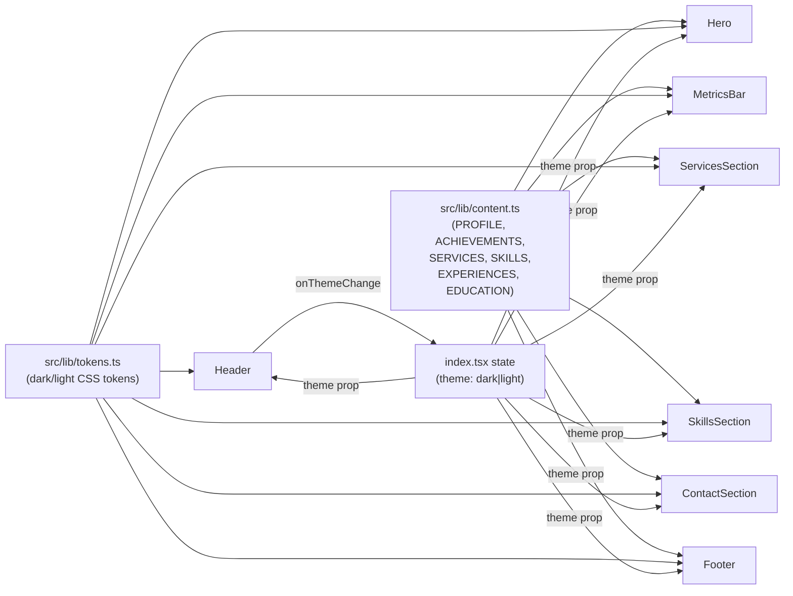
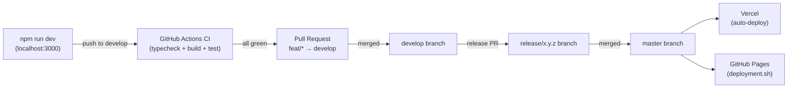

# Site Architecture — CedricTellier.github.io

## Component Tree



## Data Flow



## Build & Deploy Pipeline



## File Structure

```
CedricTellier.github.io/
├── src/
│   ├── pages/
│   │   └── index.tsx          ← App root, theme state, section assembly
│   ├── components/
│   │   ├── Header.tsx          ← Sticky nav, theme toggle
│   │   ├── Header.test.tsx
│   │   ├── Hero.tsx            ← Headline, pitch, CTA
│   │   ├── Hero.test.tsx
│   │   ├── MetricsBar.tsx      ← 4-metric grid
│   │   ├── MetricsBar.test.tsx
│   │   ├── ServicesSection.tsx ← 2×2 service cards
│   │   ├── ServicesSection.test.tsx
│   │   ├── SkillsSection.tsx   ← 3-pillar skill tags
│   │   ├── SkillsSection.test.tsx
│   │   ├── ContactSection.tsx  ← Form + terminal sidebar
│   │   ├── ContactSection.test.tsx
│   │   ├── Footer.tsx
│   │   └── Footer.test.tsx
│   ├── lib/
│   │   ├── content.ts          ← All text content (typed)
│   │   ├── tokens.ts           ← Design tokens per theme
│   │   └── types.ts            ← Shared TypeScript interfaces
│   └── styles/
│       └── globals.css         ← Base reset, CSS custom props, keyframes
├── public/
│   ├── cv.pdf
│   ├── photo.jpg
│   └── favicon.ico
├── docs/
│   ├── architecture/
│   │   ├── adr/001-portfolio-redesign.md
│   │   └── diagrams/site-architecture.md
│   └── design/
│       └── screens/portfolio-sections.md
├── .github/workflows/ci.yml
├── jest.config.js
├── jest.setup.ts
├── next.config.js              ← output: 'export', assetPrefix: './'
└── README.md
```
